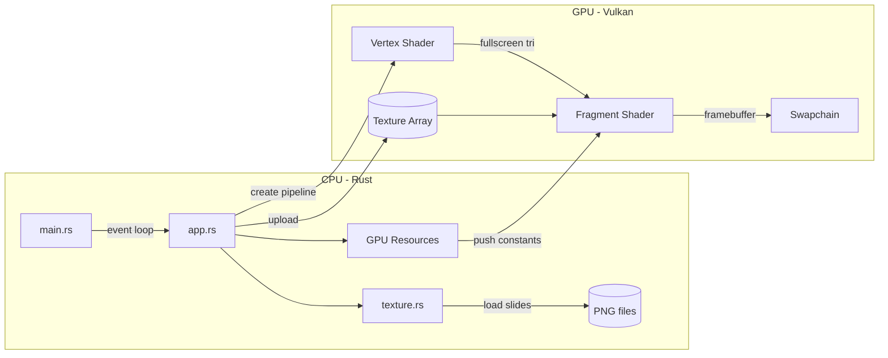
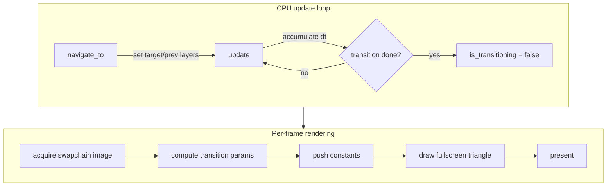
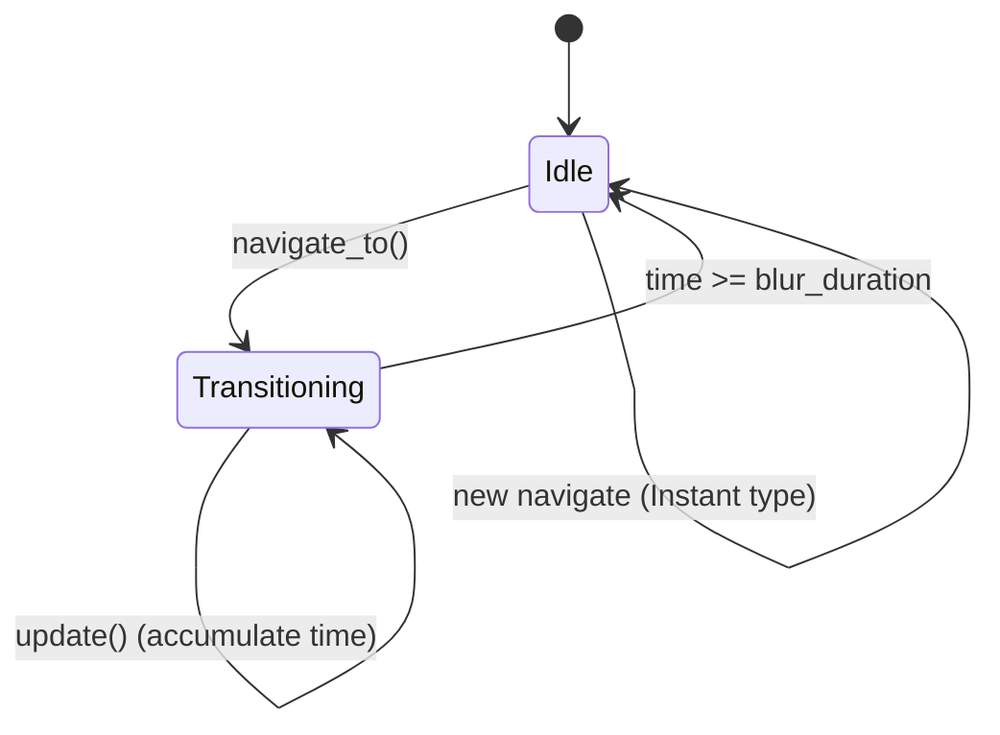
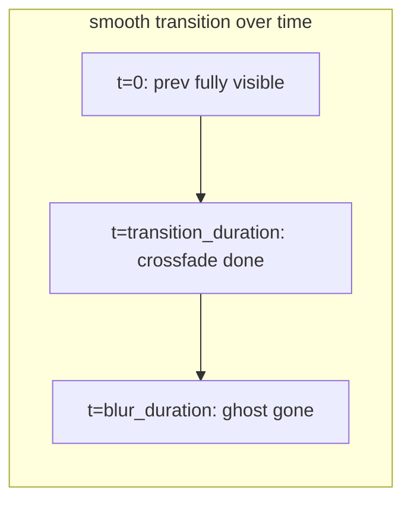
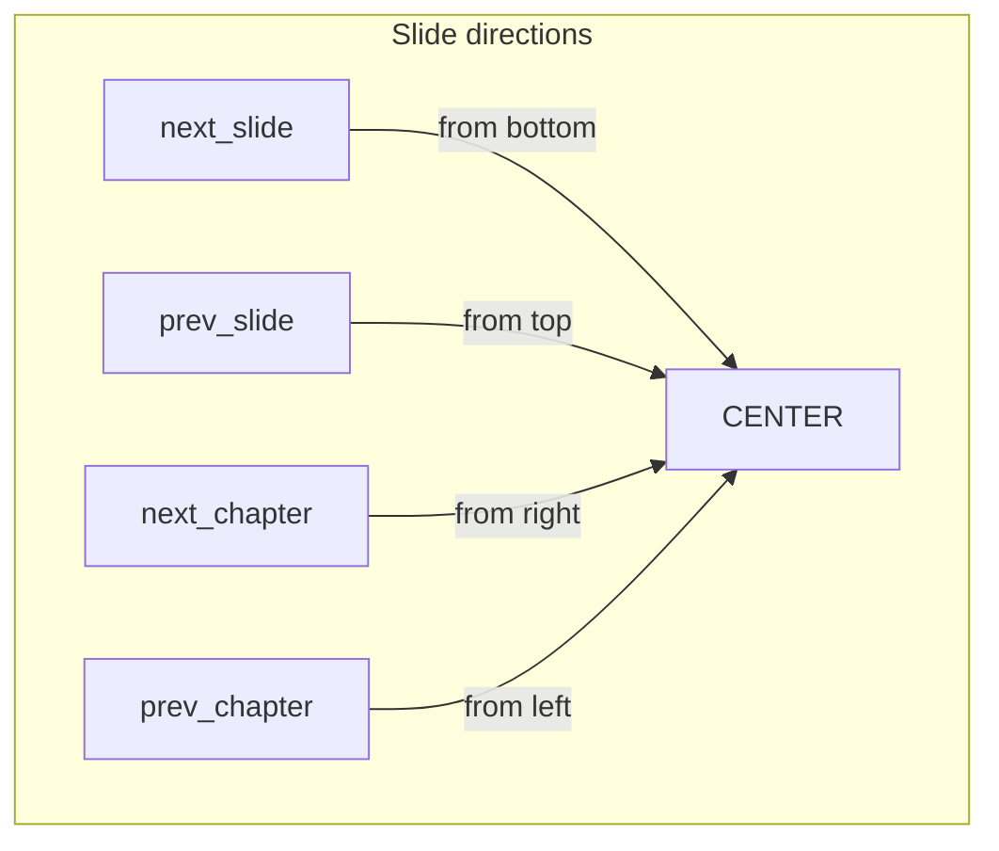
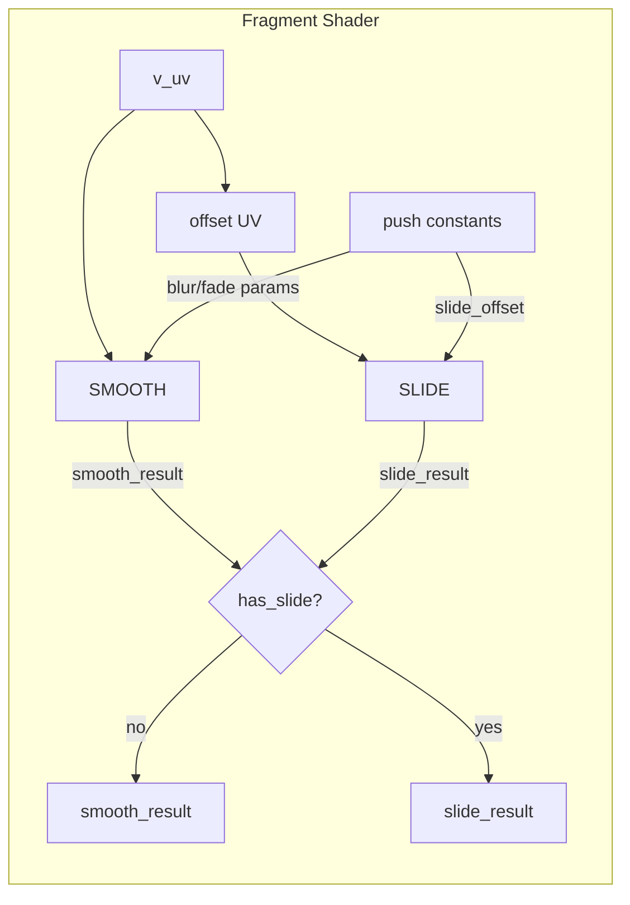

# RS-Vulkan Slides

A Vulkan-accelerated slideshow/presentation viewer. Renders PNG slides with GPU-accelerated transitions using the Vulkan API via `vulkano`.

## Usage

```text
rs-vulkan <slides-folder> [options]
rs-vulkan init <path>

Arguments:
  <slides-folder>    Directory containing chapter_slide.png files

Commands:
  init <path>        Create an example presentation at <path>

Options:
  --transition-type <type>     Transition style: smooth (default), instant, or slide
  --blur-radius <px>           Max Gaussian blur radius (smooth only; default: 20.0)
  --blur-duration <sec>        Ghost dissolve duration in seconds (smooth only; default: 10.0)
  --transition-duration <sec>  Transition duration in seconds (smooth, slide; default: 0.5)
  --help                       Show this help
```

### Slide naming

Slides are PNG files named `{chapter}_{slide}.png` (e.g. `1_1.png`, `2_3.png`). Chapters and slides are sorted numerically for keyboard navigation.

## Examples

```text
# Create a new presentation
rs-vulkan init my-talk

# Default smooth transition (blur + fade)
rs-vulkan my-talk

# Slide transition, 3 second duration
rs-vulkan my-talk --transition-type slide --transition-duration 3

# Instant cuts (no animation)
rs-vulkan my-talk --transition-type instant

# Smooth with custom blur and faster fade
rs-vulkan my-talk --blur-radius 15 --transition-duration 0.3

# Longer ghost dissolve with heavier blur
rs-vulkan my-talk --blur-duration 20 --blur-radius 40

# Combine slide transition with custom timing
rs-vulkan my-talk --transition-type slide --transition-duration 2
```

## Technical overview

### Architecture



### Rendering pipeline



### Navigation state machine



## Transition types

| Type      | Description                                 | Config parameters                          |
|-----------|---------------------------------------------|--------------------------------------------|
| `smooth`  | Blur + cross-fade + ghost dissolve          | `blur-radius`, `blur-duration`, `transition-duration` |
| `instant` | Immediate cut, no animation                 | (none)                                     |
| `slide`   | Slide new slide in with cubic ease-out      | `transition-duration`                      |

### `smooth`

The outgoing slide is blurred (Gaussian, up to `blur-radius` px), cross-faded with the incoming slide (smoothstep over `transition-duration` sec), and a dim ghost lingers for `blur-duration` sec.



### `instant`

No visual transition. `current_layer` switches immediately on navigation.

### `slide`

The incoming slide slides into view with a cubic ease-out curve (`f(t) = 1 - (1-t)³`). The outgoing slide remains stationary in the background.

| Navigation action | Direction of incoming slide |
|---|---|
| `next_slide` | Slides in from **bottom** (upward) |
| `prev_slide` | Slides in from **top** (downward) |
| `next_chapter` | Slides in from **right** (leftward) |
| `prev_chapter` | Slides in from **left** (rightward) |

Duration is controlled by `--transition-duration` (default 0.5s).



### Shader composition

The fragment shader computes two paths in parallel and selects between them:

- **Smooth path**: blurs `previous_layer`, cross-fades with `current_layer`, applies ghost
- **Slide path**: offsets `current_layer` UV by `slide_offset`, shows `previous_layer` where offset UV is out of bounds

Selection is driven by `has_slide = (slide_offset_x != 0 || slide_offset_y != 0)`, so no pipeline switch is needed.



## Push constant layout

```rust
#[repr(C)]
struct PushConstantData {
    current_layer: i32,     // texture array index of current (target) slide
    previous_layer: i32,    // texture array index of previous (source) slide
    new_alpha: f32,         // cross-fade weight (0→1, smoothstep over transition_duration)
    ghost_strength: f32,    // ghost overlay intensity (1→0 over blur_duration)
    blur_radius: f32,       // Gaussian blur radius (0→max over blur_duration)
    slide_offset_x: f32,    // horizontal UV offset for slide transition
    slide_offset_y: f32,    // vertical UV offset for slide transition
}
// Total: 28 bytes (5 × 4 + 2 × 4)
```
