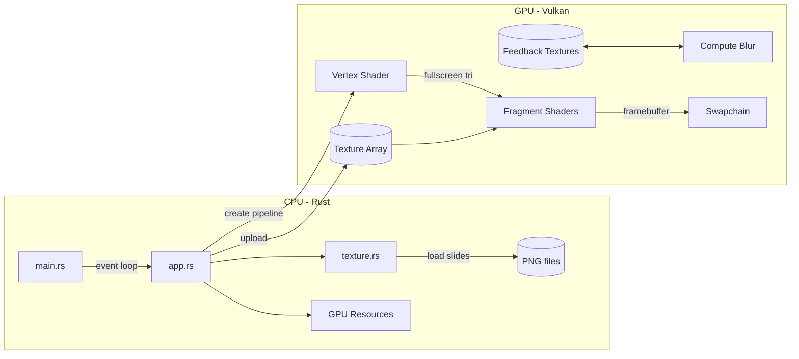
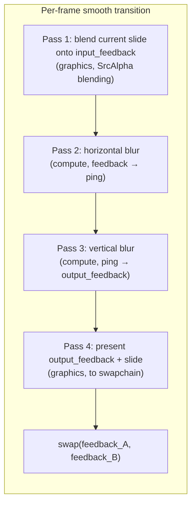

# RS-Vulkan Slides

A Vulkan-accelerated slideshow/presentation viewer. Renders PNG slides with GPU-accelerated transitions using the Vulkan API via `vulkano`.

## Usage

```text
rs-vulkan <slides-folder> [options]
rs-vulkan init <path>

Arguments:
  <slides-folder>    Directory containing chapter_slide.png files

Commands:
  init <path>        Create an example presentation at <path>

Options:
  --transition-type <type>     Transition style: smooth (default), instant, or slide
  --blur-radius <px>           Max Gaussian blur radius (smooth only; default: 20.0)
  --transition-duration <sec>  Transition duration in seconds (slide; default: 0.5)
  --profile                    Print per-frame timing breakdown every second
  --help                       Show this help
```

### Slide naming

Slides are PNG files named `{chapter}_{slide}.png` (e.g. `1_1.png`, `2_3.png`). Chapters and slides are sorted numerically for keyboard navigation.

## Examples

```text
# Create a new presentation
rs-vulkan init my-talk

# Default smooth transition (compute blur + feedback)
rs-vulkan my-talk

# Slide transition, 3 second duration
rs-vulkan my-talk --transition-type slide --transition-duration 3

# Instant cuts (no animation)
rs-vulkan my-talk --transition-type instant

# Smooth with heavier blur
rs-vulkan my-talk --blur-radius 40

# Combine slide transition with custom timing
rs-vulkan my-talk --transition-type slide --transition-duration 2
```

## Technical overview

### Architecture



### Smooth transition (feedback + compute blur)



### Pipeline breakdown (smooth transition)

| Pass | Type | Source → Dest | Shader |
|------|------|---------------|--------|
| 1 | Graphics | slides → feedback (LOAD, alpha blend) | `fs_blend` |
| 2 | Compute | feedback → ping (horizontal Gaussian) | `cs_blur_h` |
| 3 | Compute | ping → feedback (vertical Gaussian) | `cs_blur_v` |
| 4 | Graphics | feedback + slides → swapchain (CLEAR) | `fs_present` |

The input and output feedback textures are swapped at the end of each frame via `feedback_idx ^= 1`, creating an infinite-impulse-response (IIR) blur that progressively blurs the previous content while the new slide accumulates via alpha blending.

### Non-smooth paths

For `instant` and `slide` transition types (and when not transitioning in `smooth` mode), a single graphics pass draws directly to the swapchain:

- `Instant`: just the current layer, fullscreen.
- `Slide`: previous layer stays, current layer slides in with cubic ease-out (`f(t) = 1 - (1-t)³`).

### Push constant layout

```rust
#[repr(C)]
struct PushConstants {
    current_layer: i32,     // texture array index of current (target) slide
    previous_layer: i32,    // texture array index of previous (source) slide
    new_alpha: f32,         // cross-fade / blend weight (0→1, smoothstep)
    blur_radius: f32,       // Gaussian blur kernel radius (compute shader)
    slide_offset_x: f32,    // horizontal UV offset for slide transition
    slide_offset_y: f32,    // vertical UV offset for slide transition
}
// Total: 24 bytes
```

## Transition types

| Type      | Description                                       | Config parameters            |
|-----------|---------------------------------------------------|------------------------------|
| `smooth`  | Compute-shader Gaussian blur + feedback ping-pong | `blur-radius`                |
| `instant` | Immediate cut, no animation                       | (none)                       |
| `slide`   | Slide new slide in with cubic ease-out            | `transition-duration`        |

### `smooth`

Uses a two-texture feedback loop. Each frame during the transition:

1. The target slide is alpha-blended onto the input feedback texture (accumulates)
2. A separable Gaussian blur runs in a compute shader (horizontal → vertical, via a ping-pong intermediate)
3. The output feedback is drawn to the swapchain, with the target slide blended on top
4. The feedback textures are swapped for next frame

The blur radius is constant (`--blur-radius`) during the transition. Because the blur is applied every frame, old content progressively blurs out via the IIR feedback loop while the new slide becomes dominant through continuous alpha blending.

### `instant`

No visual transition. `current_layer` switches immediately on navigation.

### `slide`

The incoming slide slides into view with a cubic ease-out curve (`f(t) = 1 - (1-t)³`). The outgoing slide remains stationary in the background.

| Navigation action | Direction of incoming slide |
|---|---|
| `next_slide` | Slides in from **bottom** (upward) |
| `prev_slide` | Slides in from **top** (downward) |
| `next_chapter` | Slides in from **right** (leftward) |
| `prev_chapter` | Slides in from **left** (rightward) |

Duration is controlled by `--transition-duration` (default 0.5s).
