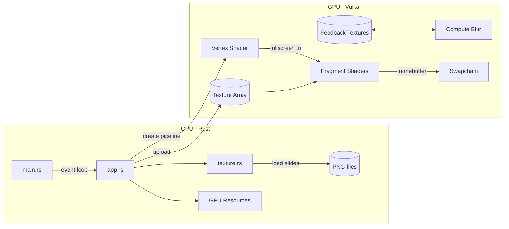
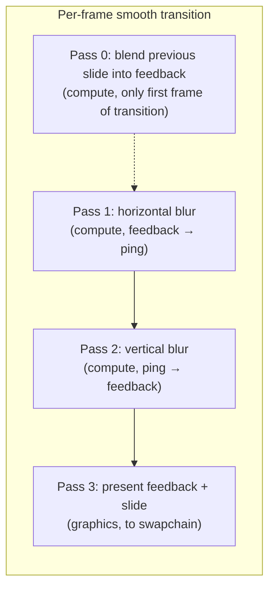

# RS-Vulkan Slides

A Vulkan-accelerated slideshow/presentation viewer. Renders PNG slides with GPU-accelerated transitions using the Vulkan API via `vulkano`.

## Usage

```text
rs-vulkan <slides-folder> [options]
rs-vulkan init <path>

Arguments:
  <slides-folder>    Directory containing chapter_slide.png files

Commands:
  init <path>        Create an example presentation at <path>

Options:
  --transition-type <type>     Transition style: smooth (default), instant, or slide
  --transition-duration <sec>  Transition duration in seconds (slide; default: 0.5)
  --help                       Show this help
```

### Slide naming

Slides are PNG files named `{chapter}_{slide}.png` (e.g. `1_1.png`, `2_3.png`). Chapters and slides are sorted numerically for keyboard navigation.

## Examples

```text
# Create a new presentation
rs-vulkan init my-talk

# Default smooth transition (compute blur + feedback)
rs-vulkan my-talk

# Slide transition, 3 second duration
rs-vulkan my-talk --transition-type slide --transition-duration 3

# Instant cuts (no animation)
rs-vulkan my-talk --transition-type instant

# Combine slide transition with custom timing
rs-vulkan my-talk --transition-type slide --transition-duration 2
```

## Technical overview

### Architecture



### Smooth transition (feedback + compute blur)



### Pipeline breakdown (smooth transition)

| Pass | Type | Source → Dest | Shader |
|------|------|---------------|--------|
| 0¹ | Compute | previous slide → feedback (alpha blend) | `cs_blend_slide` |
| 1 | Compute | feedback → ping (horizontal Gaussian) | `cs_blur_h` |
| 2 | Compute | ping → feedback (vertical Gaussian) | `cs_blur_v` |
| 3 | Graphics | feedback + slides → swapchain (CLEAR) | `fs_present` |

> ¹ Pass 0 runs only on the first frame of each transition. It seeds the feedback buffer with the departing (previous) slide content so the blur loop begins from a clean state. Subsequent frames skip this pass — the slide never re-enters the feedback loop.

A single feedback texture stores the IIR (infinite-impulse-response) accumulation. The separable blur reads from the feedback buffer, writes to a ping intermediate, then reads from ping and writes back to feedback — no texture swapping is needed.

### Non-smooth paths

For `instant` and `slide` transition types (and when not transitioning in `smooth` mode), a single graphics pass draws directly to the swapchain:

- `Instant`: just the current layer, fullscreen.
- `Slide`: previous layer stays, current layer slides in with cubic ease-out (`f(t) = 1 - (1-t)³`).

### Push constant layout

```rust
#[repr(C)]
struct PushConstants {
    current_layer: i32,     // texture array index of current (target) slide
    previous_layer: i32,    // texture array index of previous (source) slide
    blur_radius: f32,       // Gaussian blur kernel radius (compute shader)
    slide_offset_x: f32,    // horizontal UV offset for slide transition
    slide_offset_y: f32,    // vertical UV offset for slide transition
}
// Total: 20 bytes
```

## Transition types

| Type      | Description                                       | Config parameters            |
|-----------|---------------------------------------------------|------------------------------|
| `smooth`  | Compute-shader Gaussian blur with single feedback buffer | (none)                       |
| `instant` | Immediate cut, no animation                       | (none)                       |
| `slide`   | Slide new slide in with cubic ease-out            | `transition-duration`        |

### `smooth`

Uses a single feedback buffer with a separable Gaussian blur. Each frame during the transition:

1. (First frame only) The **previous** (departing) slide is alpha-blended into the feedback buffer to seed the IIR loop — `cs_blend_slide` compute shader
2. Horizontal blur: feedback → ping intermediate — `cs_blur_h` compute shader
3. Vertical blur: ping → feedback — `cs_blur_v` compute shader
4. The blurred feedback is drawn to the swapchain with the **target** slide composited on top — `fs_present` fragment shader

The blur radius is constant during the transition (default 20). Because the blur is applied every frame, the seeded previous-slide content progressively blurs out while the target slide is composited fresh each frame — it never re-enters the feedback loop.

### `instant`

No visual transition. `current_layer` switches immediately on navigation.

### `slide`

The incoming slide slides into view with a cubic ease-out curve (`f(t) = 1 - (1-t)³`). The outgoing slide remains stationary in the background.

| Navigation action | Direction of incoming slide |
|---|---|
| `next_slide` | Slides in from **bottom** (upward) |
| `prev_slide` | Slides in from **top** (downward) |
| `next_chapter` | Slides in from **right** (leftward) |
| `prev_chapter` | Slides in from **left** (rightward) |

Duration is controlled by `--transition-duration` (default 0.5s).
